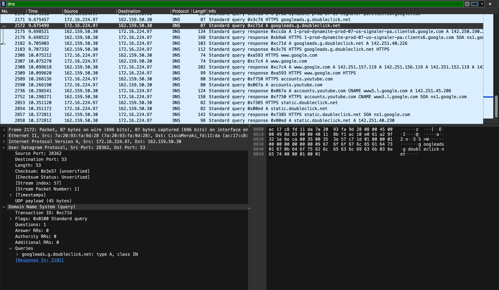
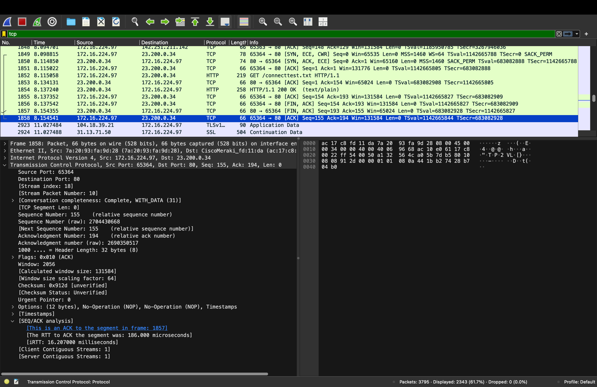
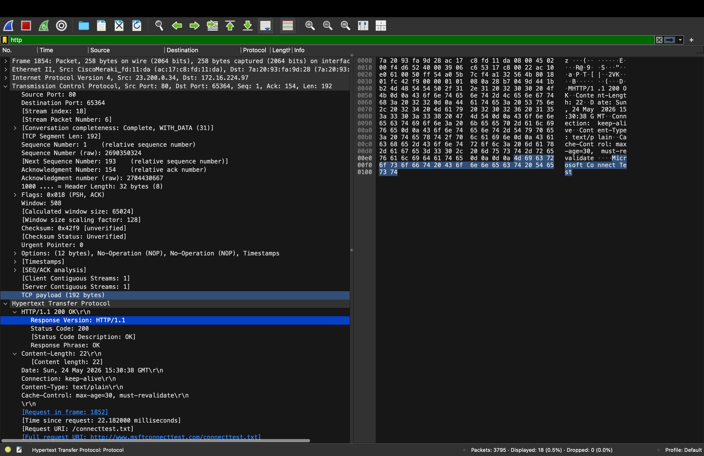

# Day 3: Wireshark Basics

## Objective
Learn how to capture and analyze packets using Wireshark.

## Concepts
- Packets carry network data
- Wireshark allows for inspection of network traffic
- Filters make traffic analysis easier

## DNS Traffic

Filter used:

dns

DNS translates domain names into IP addresses.

Screenshot:

---

## TCP Handshake

Filter used:

tcp

TCP uses a three-way handshake to establish connection:

SYN -> SYN-ACK -> ACK

Screenshot:
Screenshot:

---

## HTTP Traffic

Filter used:

http

HTTP is used for transferring website data between clients and servers.

Observed:
- GET requests
- Server responses
- Headers

HTTP traffic is not encrypted.

Screenshot:
