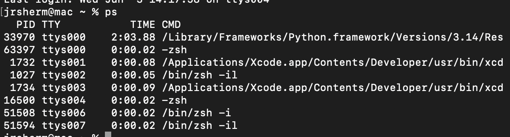
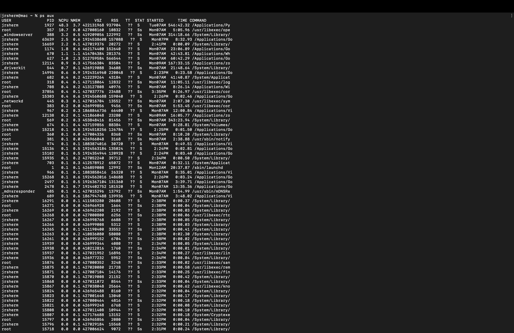
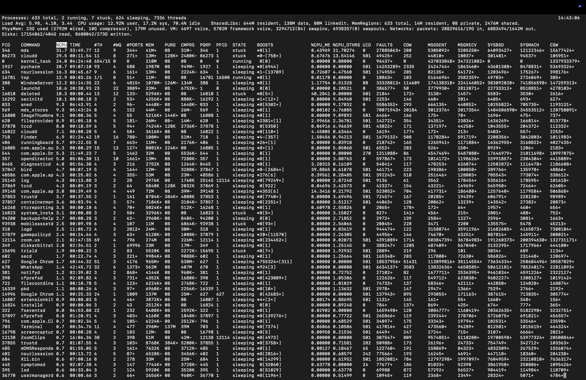
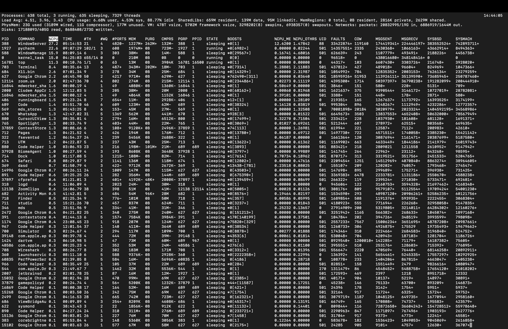
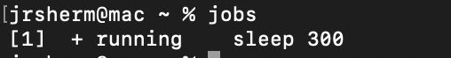

# Day 7: Linux Processes

## Objective

Understand how Linux processes work and how to view, monitor, and manage them using commands such as `ps`, `ps aux`, `top`, `jobs`, and `kill`.

## Commands Practiced

### View Processes

```bash
ps
```

Shows processes associated with the current terminal session.



### View All Processes

```bash
ps aux
```

Shows detailed information about all processes currently running.



### Monitor Processes

```bash
top
```

Displays a live view of running processes and system resource usage.




### Create a Background Job

```bash
sleep 100 &
```

Starts a process in the background.

### View Background Jobs

```bash
jobs
```

Shows processes started from the current shell.



### Terminate a Process

```bash
kill %1
```

Stops the specified background job.

## Key Concepts Learned

### PID

Each process has a unique Process ID (PID).

### ps vs ps aux

- `ps` shows processes attached to the current terminal.
- `ps aux` shows nearly all processes running on the system.

### top

Provides a live, continuously updating view of running processes.

### jobs

Shows background jobs started from the current shell.

### kill

Terminates a process or job.