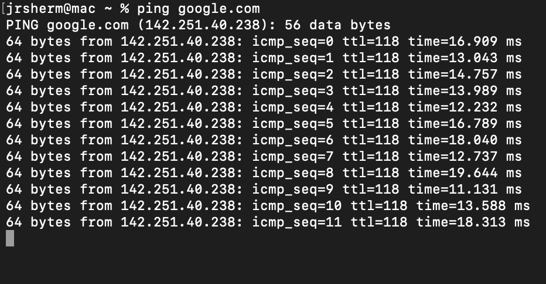
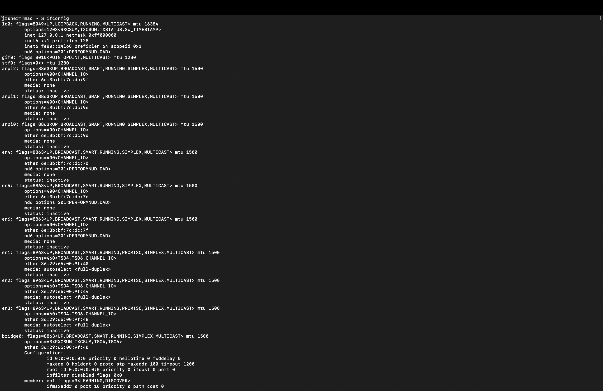
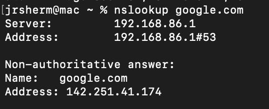
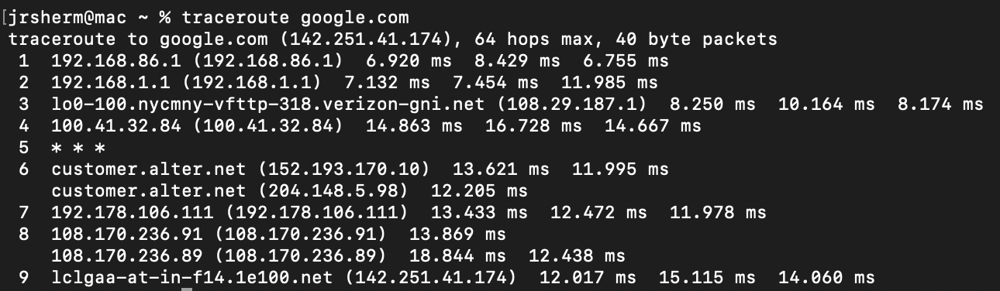
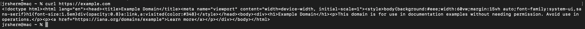

# Day 8: Network Commands

## Objective

Learn basic Linux networking commands used to test connectivity, inspect network settings, perform DNS lookups, and make web requests.

## Commands Practiced

### Test Connectivity

```bash
ping google.com
```

Checks whether another host can be reached over the network.



### View Network Information

```bash
ifconfig
```

Displays network interfaces and IP addresses.



### DNS Lookup

```bash
nslookup google.com
```

Shows the IP address associated with a domain name.



### Trace Network Route

```bash
traceroute google.com
```

Displays the path packets take to reach a destination.



### HTTP Request

```bash
curl https://example.com
```

Retrieves data from a website.



---

## Key Concepts Learned

- ping: Tests connectivity to another host
- traceroute: Shows the route packets take through the network
- curl: Command-line tool for making HTTP requests
- ifconfig: displays information about network interfaces
- nslookup: returns IP address of a specific domain name